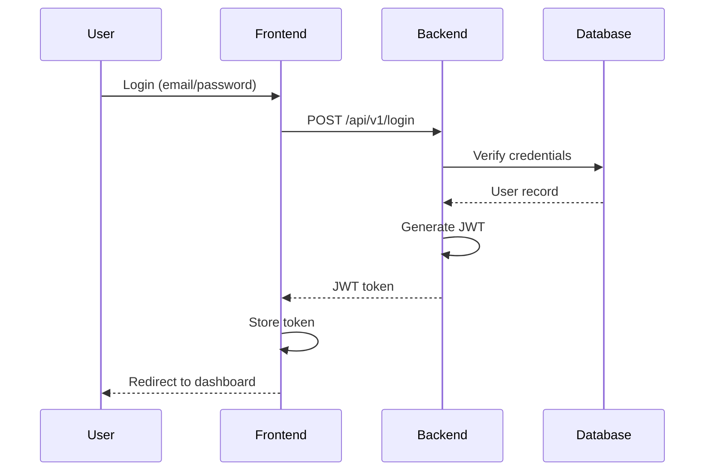
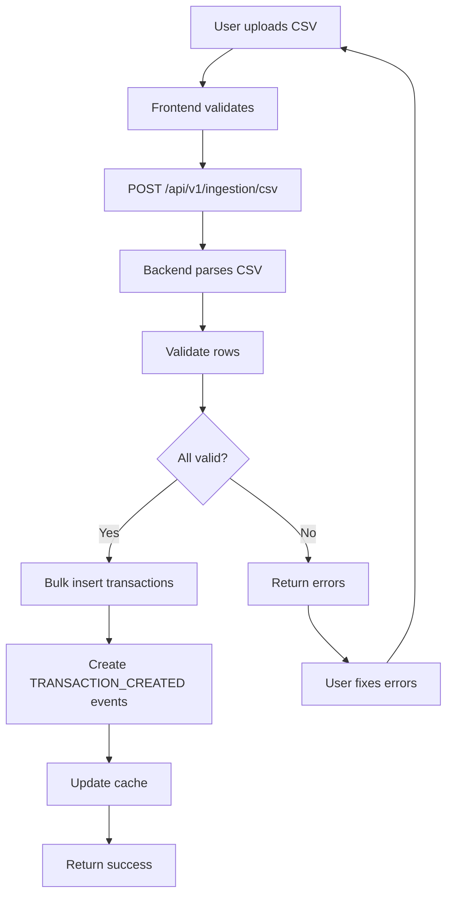
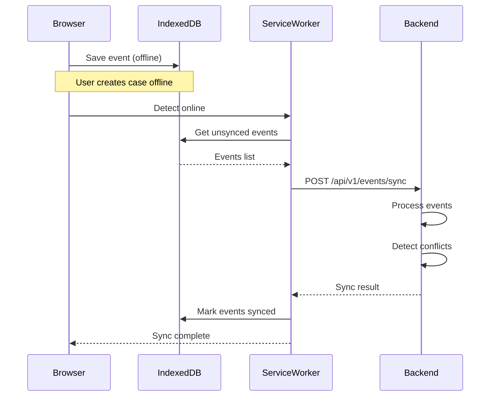
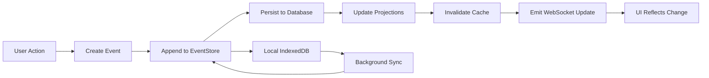

# Documentation Index

Welcome to the Fraud Detection System documentation. This index provides quick navigation to all documentation resources.

## 📚 Core Documentation

### Getting Started
- **[README.md](/README.md)** - Project overview and quick start
- **[CONTRIBUTING.md](/CONTRIBUTING.md)** - Contribution guidelines for developers and AI agents
- **[CODEOWNERS](/CODEOWNERS)** - Code review responsibilities

### Development Guides
- **[Backend README](/backend/README.md)** - Backend setup, testing, and development
- **[Frontend README](/frontend/README.md)** - Frontend setup, build, deployment, and testing
- **[Backend Services](/backend/app/services/README.md)** - Service layer architecture and patterns

### Security & Quality
- **[Security & Quality Guide](/docs/SECURITY_AND_QUALITY.md)** - Comprehensive security, testing, monitoring, and optimization guide
  - Vulnerability management
  - Testing strategies
  - Incident response procedures
  - Performance optimization
  - Monitoring and alerting

## 🏗️ Architecture & Design

### System Architecture
- **[Architecture Overview](/docs/architecture/README.md)** - High-level system design
- **[API Design Patterns](/docs/backend/API_DESIGN_PATTERNS.md)** - RESTful and GraphQL patterns
- **[Database Schema](/docs/architecture/database-schema.md)** - Entity relationship diagrams
- **[Event Sourcing](/docs/architecture/event-sourcing.md)** - Event sourcing implementation

### Decision Records
- **[ADR Directory](/docs/architecture/decisions/)** - Architecture decision records
  - Why certain technologies were chosen
  - Trade-offs and alternatives considered
  - Migration paths

## 🎨 Frontend Documentation

### Pages and Components
- **[Dashboard](/docs/frontend/pages/01_DASHBOARD.md)** - Dashboard page specification
- **[Case Management](/docs/frontend/pages/02_CASE_DETAIL.md)** - Case detail and timeline
- **[Ingestion](/docs/frontend/pages/03_INGESTION.md)** - Data import features
- **[Analytics](/docs/frontend/pages/04_ANALYTICS.md)** - Analytics and reporting
- **[Forensics](/docs/frontend/pages/05_FORENSICS.md)** - Forensic analysis tools
- **[Reconciliation](/docs/frontend/pages/06_RECONCILIATION.md)** - Data reconciliation
- **[Adjudication](/docs/frontend/pages/07_ADJUDICATION.md)** - Alert adjudication queue
- **[Visualization](/docs/frontend/pages/08_VISUALIZATION.md)** - Data visualization
- **[Summary](/docs/frontend/pages/10_SUMMARY.md)** - Summary and reporting

### Implementation Guides
- **[Enhancement Guide](/docs/frontend/ENHANCEMENT_IMPLEMENTATION_GUIDE.md)** - Feature implementation checklist
- **[Component Patterns](/docs/frontend/COMPONENT_PATTERNS.md)** - Reusable React patterns

## 🔧 Operations & Deployment

### CI/CD
- **[CI/CD Quick Start](/docs/CI_CD_QUICK_START.md)** - Continuous integration and deployment
- **[Testing Standards](/docs/TESTING_AND_QUALITY_STANDARDS.md)** - QA requirements
- **[Deployment Guide](/docs/DEPLOYMENT.md)** - Production deployment procedures

### Infrastructure
- **[Docker Setup](/docs/DOCKER.md)** - Container orchestration
- **[Monitoring Setup](/docs/MONITORING.md)** - Prometheus and Grafana configuration
- **[Backup & Recovery](/docs/BACKUP_RECOVERY.md)** - Data protection procedures

## 🤖 AI Agent Guidelines

### For GitHub Copilot & AI Assistants
- **[AGENTS.md](/AGENTS.md)** - Comprehensive guide for AI agents
- **[Task Guidelines](/docs/COPILOT_TASK_GUIDELINES.md)** - Task suitability reference
- **[Agent Coordination](/.agent/rules/agent_coordination.mdc)** - Multi-agent coordination rules

### Workflows
- **[Workflows Directory](/.agent/workflows/)** - Automated workflow procedures
  - `/planning` - Feature planning workflow
  - `/verify_mcp_config` - MCP server verification
  - `/workflow` - Main development workflow

## 🔐 Security Documentation

### Security Procedures
- **[Security Hardening](/docs/SECURITY_AND_QUALITY.md#security)** - Security checklist and best practices
- **[Vulnerability Management](/docs/SECURITY_AND_QUALITY.md#vulnerability-management)** - Scanning and response
- **[Secrets Management](/docs/SECURITY_AND_QUALITY.md#secrets-management)** - Credential handling
- **[Incident Response](/docs/SECURITY_AND_QUALITY.md#incident-response)** - Emergency procedures

### Compliance
- **[GDPR Compliance](/docs/compliance/GDPR.md)** - Privacy regulation compliance
- **[Data Protection](/docs/compliance/DATA_PROTECTION.md)** - Data handling policies
- **[Audit Logging](/docs/compliance/AUDIT_LOGGING.md)** - Audit trail requirements

## 🧪 Testing Documentation

### Testing Strategy
- **[Testing Guide](/docs/SECURITY_AND_QUALITY.md#quality-assurance)** - Comprehensive testing strategy
  - Unit testing (80%+ coverage)
  - Integration testing
  - E2E testing with Playwright
  - Migration testing

### Test Reports
- **Coverage Reports** - Generated in `coverage/` directories
- **E2E Test Reports** - Generated in `playwright-report/`
- **Performance Reports** - Lighthouse CI reports

## 📊 Process Diagrams

### System Flows

#### Authentication Flow


#### Transaction Ingestion Flow


#### Offline Sync Flow


#### Event Sourcing Flow


## 🗂️ File Organization

### Backend Structure
```
backend/
├── app/
│   ├── api/              # API endpoints (see Backend README)
│   ├── core/             # Core utilities (config, security, logging)
│   ├── db/               # Database models and session
│   ├── graphql/          # GraphQL schema
│   ├── services/         # Business logic (see Services README)
│   ├── schemas/          # Pydantic request/response models
│   └── main.py           # FastAPI application
├── alembic/              # Database migrations
├── tests/                # Test suite
└── pyproject.toml        # Python dependencies
```

### Frontend Structure
```
frontend/
├── src/
│   ├── components/       # React components (see Frontend README)
│   ├── pages/            # Page components (see Page docs)
│   ├── lib/              # API client, utilities
│   ├── hooks/            # Custom React hooks
│   └── stores/           # State management
├── tests/                # E2E tests (Playwright)
├── public/               # Static assets
└── package.json          # Node.js dependencies
```

### Documentation Structure
```
docs/
├── architecture/         # System design documents
├── frontend/             # Frontend-specific docs
│   └── pages/           # Individual page specifications
├── backend/              # Backend-specific docs
├── compliance/           # GDPR, audit logging
└── SECURITY_AND_QUALITY.md  # Security and QA guide
```

## 🔍 Quick Reference

### Common Tasks

| Task | Documentation | Command |
|------|---------------|---------|
| Start development | [README.md](/README.md) | `docker-compose up` |
| Run tests (backend) | [Backend README](/backend/README.md) | `cd backend && poetry run pytest` |
| Run tests (frontend) | [Frontend README](/frontend/README.md) | `cd frontend && npm test` |
| Create migration | [Backend README](/backend/README.md) | `alembic revision --autogenerate` |
| Build production | [Frontend README](/frontend/README.md) | `npm run build` |
| Security scan | [Security Guide](/docs/SECURITY_AND_QUALITY.md) | `npm audit && poetry run safety check` |
| View metrics | [Monitoring](/docs/MONITORING.md) | `http://localhost:9090` (Prometheus) |

### Key Concepts

| Concept | Documentation | Description |
|---------|---------------|-------------|
| Event Sourcing | [Event Sourcing](/docs/architecture/event-sourcing.md) | Immutable event log for audit trail |
| Offline-First | [PWA Guide](/docs/frontend/PWA.md) | Service Worker + IndexedDB |
| GraphQL API | [API Patterns](/docs/backend/API_DESIGN_PATTERNS.md) | Alternative to REST |
| Async Architecture | [Backend README](/backend/README.md) | FastAPI with async/await |
| React Query | [Frontend README](/frontend/README.md) | Server state management |

## 📞 Support & Resources

### Internal Resources
- **Slack Channel**: #fraud-detection-dev
- **Issue Tracker**: GitHub Issues
- **Wiki**: Project Wiki (internal)

### External Resources
- [FastAPI Documentation](https://fastapi.tiangolo.com/)
- [React Documentation](https://react.dev/)
- [TypeScript Handbook](https://www.typescriptlang.org/docs/)
- [Playwright Documentation](https://playwright.dev/)
- [Docker Documentation](https://docs.docker.com/)

## 🚀 What's Next?

### Roadmap Documents
- **[OPTIMIZATION_STATUS.txt](/OPTIMIZATION_STATUS.txt)** - Current optimization efforts
- **[PHASE5_COMPLETION_STATUS.txt](/PHASE5_COMPLETION_STATUS.txt)** - Phase 5 completion checklist
- **[GitHub Projects](https://github.com/teoat/Simple378/projects)** - Sprint planning

### Contributing
New to the project? Start here:
1. Read [CONTRIBUTING.md](/CONTRIBUTING.md)
2. Set up your development environment ([README.md](/README.md))
3. Pick a "good first issue" from GitHub
4. Follow the [Pull Request Template](/.github/pull_request_template.md)

---

**Last Updated**: 2025-12-07

For questions or clarifications, please:
- Open a GitHub Discussion
- Create an issue
- Contact @teoat (CODEOWNER)
