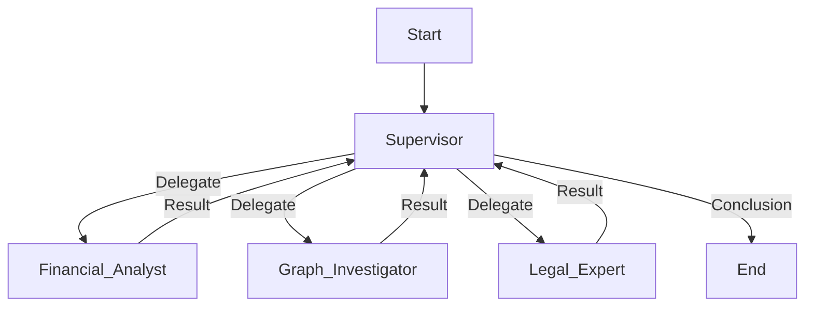

# Deep Dive: AI Orchestration & Agentic Workflow

## 1. Overview
This document defines the architecture for the **AI Orchestrator** (Phase 3), which uses **LangGraph** to manage a team of specialized AI agents. The goal is to automate complex fraud investigation tasks that require multi-step reasoning, tool usage, and human-in-the-loop verification.

## 2. Architecture: Supervisor-Worker Pattern
We will use a **Hierarchical Agent Teams** pattern.

### 2.1 The Supervisor (Orchestrator)
- **Role:** Project Manager.
- **Responsibilities:**
    - Receives the high-level objective (e.g., "Investigate Subject X for structuring").
    - Breaks down the objective into sub-tasks.
    - Delegates tasks to specific Worker Agents.
    - Aggregates results and forms a final conclusion.
- **State:** Maintains the `InvestigationState` (shared context).

### 2.2 Worker Agents (MCP Clients)
Each worker is a specialized agent that can be called via MCP or LangGraph.

| Agent Name | Role | Tools (MCP) |
| :--- | :--- | :--- |
| **Document Processor** | Auto-categorize uploads, extract metadata. | `extract_receipt_data`, `ocr_document` |
| **Fraud Analyst** | Multi-persona analysis (Auditor, Prosecutor). | `flag_expense_fraud`, `generate_sar_narrative`, `brave-search` |
| **Reconciliation Engine** | Matches fund releases to expenses. | `match_bank_transaction`, `calculate_variance`, `github` |
| **Report Generator** | Assembles visualizations and legal packages. | `render_reconciliation_html` |

## 3. LangGraph Workflow
The workflow is a state machine graph.



### 3.1 Shared State Schema
```python
class InvestigationState(TypedDict):
    subject_id: str
    messages: List[BaseMessage]
    next_step: str
    findings: Dict[str, Any]
    final_verdict: Optional[str]
```

## 4. Human-in-the-Loop (HITL)
- **Checkpoints:** The graph execution pauses at critical nodes (e.g., before `Legal Expert` generates a SAR).
- **Intervention:** A human analyst can:
    - Review the `findings` so far.
    - Edit the `next_step` or provide feedback.
    - Approve the continuation.

## 5. Technology Stack
- **Framework:** LangGraph (built on LangChain).
- **LLM:** Anthropic Claude 3.5 Sonnet (for reasoning) / Haiku (for simple tasks).
- **Memory:** Postgres (via `langgraph-checkpoint-postgres`) for persisting state.
