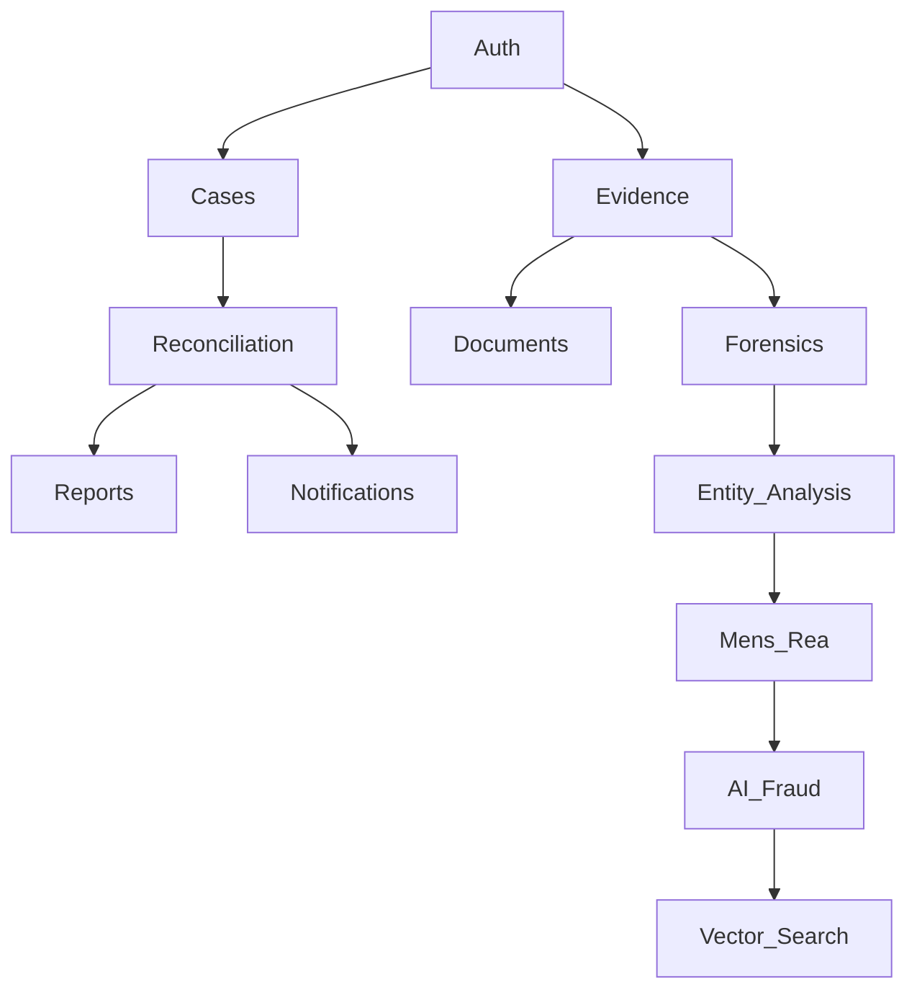

# Modularization Strategy & Feature Tiers

## 1. Project Structure (Monorepo)
We will adopt a **pnpm workspace** structure to modularize the frontend and shared TypeScript logic, while maintaining the FastAPI backend.

```
Simple378/
├── packages/                     # Shared TypeScript Packages
│   ├── auth/                    # @reconciliation/auth (Better Auth)
│   ├── cases/                   # @reconciliation/cases (State/Types)
│   ├── evidence/                # @reconciliation/evidence (Client Logic)
│   ├── notifications/           # @reconciliation/notifications (Novu)
│   ├── api-client/              # @reconciliation/api-client (Generated)
│   ├── ui/                      # @reconciliation/ui (Shared Components)
│   └── utils/                   # @reconciliation/utils
├── apps/
│   ├── backend/                 # FastAPI (Python)
│   └── frontend/                # React (Vite)
└── pnpm-workspace.yaml
```

## 2. Feature Tiers

### SIMPLE TIER (Foundation)
- **Auth:** Better Auth (Self-hosted).
- **Reconciliation:** Basic phase budget vs expenses.
- **Documents:** Tesseract OCR.
- **Notifications:** Novu (Email).
- **Reports:** Simple PDF export.

### ADVANCED TIER (AI & Forensics)
- **AI Fraud:** Multi-persona analysis (Claude 3.5).
- **Forensics:** ExifTool, OpenCV manipulation detection.
- **Entity Analysis:** NetworkX graph building.
- **Mens Rea:** Criminal intent scoring.
- **Vector Search:** Qdrant.
- **Search:** Meilisearch.

### EXTREME TIER (Enterprise & Legal)
- **Agents:** MCP Multi-agent orchestration.
- **Offline:** RxDB (Offline-first sync).
- **Collaboration:** Liveblocks.
- **Workflows:** Temporal.io.
- **Blockchain:** Evidence notarization.

## 3. Technology Stack Decisions

| Category | Recommended | Why? |
| :--- | :--- | :--- |
| **Auth** | **Better Auth** | TypeScript-first, self-hosted, GDPR compliant. |
| **Notifications** | **Novu** | Multi-channel, self-hosted, template management. |
| **Vector DB** | **Qdrant** | High performance, local deployment, Rust-based. |
| **Offline** | **RxDB** | Observable queries, conflict resolution, works with any backend. |
| **Search** | **Meilisearch** | Typo-tolerance, fast, easy setup. |
| **Collaboration** | **Liveblocks** | CRDTs, easy React integration. |
| **Feature Flags** | **Unleash** | A/B testing, gradual rollouts. |
| **Gateway** | **Kong** | Rate limiting, auth proxy (Phase 5). |

## 4. Module Dependency Graph

