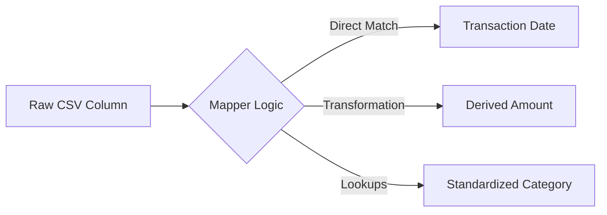

# 📥 Ingestion & Mapping Page

> Upload data and define field mappings

**Route:** `/ingestion`  
**File:** `src/pages/Forensics.tsx` (to be renamed)

---

## Overview

The Ingestion & Mapping page is the entry point for new data into the system. Users can upload files, connect to databases, or configure API feeds. After ingestion, they define how source fields map to the system's data model.

---

## Screenshot

```text
┌─────────────────────────────────────────────────────────────────────────────┐
│ 📥 Data Ingestion                                              [+ New Job]  │
├─────────────────────────────────────────────────────────────────────────────┤
│                                                                             │
│  Progress: ─────●─────────────────────────────────────────────             │
│            ① Source  ② Upload  ③ Mapping  ④ Preview  ⑤ Confirm             │
│                                                                             │
│  ┌─────────────────────────────────────────────────────────────────────┐   │
│  │ SELECT DATA SOURCE                                                   │   │
│  ├─────────────────────────────────────────────────────────────────────┤   │
│  │                                                                      │   │
│  │  ┌─────────────┐  ┌─────────────┐  ┌─────────────┐                  │   │
│  │  │ 📁          │  │ 🗄️          │  │ 🔗          │                  │   │
│  │  │ FILE        │  │ DATABASE    │  │ API FEED    │                  │   │
│  │  │ UPLOAD      │  │ CONNECTION  │  │             │                  │   │
│  │  │   [✓]       │  │   [ ]       │  │   [ ]       │                  │   │
│  │  └─────────────┘  └─────────────┘  └─────────────┘                  │   │
│  │                                                                      │   │
│  │  Supported: CSV, JSON, XML, Excel, PDF (OCR)                        │   │
│  │                                                                      │   │
│  └─────────────────────────────────────────────────────────────────────┘   │
│                                                                             │
│  ┌─────────────────────────────────────────────────────────────────────┐   │
│  │                                                                      │   │
│  │                    ╔═══════════════════════════╗                    │   │
│  │                    ║                           ║                    │   │
│  │                    ║   📁 Drop files here     ║                    │   │
│  │                    ║   or click to browse      ║                    │   │
│  │                    ║                           ║                    │   │
│  │                    ╚═══════════════════════════╝                    │   │
│  │                                                                      │   │
│  └─────────────────────────────────────────────────────────────────────┘   │
│                                                                             │
│                                              [Cancel]  [Next: Upload →]    │
└─────────────────────────────────────────────────────────────────────────────┘
```

---

## Features

| Feature | Status | Description |
|---------|--------|-------------|
| File Upload | ✅ | Drag-and-drop or click to upload |
| Database Connection | 🔲 | Connect to SQL/NoSQL databases |
| API Feed | 🔲 | Configure REST/GraphQL endpoints |
| Progress Pipeline | ✅ | Visual step-by-step progress |
| OCR Processing | ✅ | Extract text from PDF/images |
| Metadata Extraction | ✅ | Parse file metadata |
| Virus Scanning | ✅ | Security check on uploads |
| CSV Import Wizard | ✅ | Column mapping for CSV files |
| AI Auto-Mapping | 🚀 | *Proposed:* ML prediction of column types |
| Mapping Templates | 🚀 | *Proposed:* Save/Load mapping configs |
| Data Hygiene | 🚀 | *Proposed:* Auto-cleaning rules |
| Multi-File Stitching | 🚀 | *Proposed:* Merge multiple PDFs |
| Redaction Gap Analysis | 🚀 | *Proposed:* Infer missing values |

---

## Ingestion Steps

### Step 1: Source Selection
- Choose data source type
- File Upload (most common)
- Database Connection
- API Feed

### Step 2: Upload / Connect
- **File Upload:** Drag-and-drop zone with validation
- **Database:** Connection string, credentials
- **API:** Endpoint URL, authentication

### Step 3: Mapping
- View detected fields
- Map source → target fields
- Define transformations
- Handle data type conversions

### Step 4: Preview
- Show first 10 rows
- Validation messages
- Data quality indicators
- Fix errors before commit

### Step 5: Confirm
- Summary of upload
- Start ingestion process
- Real-time progress tracking
- Completion notification

---

### 🔍 Detailed Field Mapping

The mapping interface allows users to link source columns to the internal data schema.



#### Mapping Logic
- **Direct Matching:** 1-to-1 link (e.g., "Date" -> `transaction_date`)
- **Combined Fields:** Merge two columns (e.g., "First Name" + "Last Name" -> `full_name`)
- **Conditional Formatting:** Flip signs based on "Type" column (Debit/Credit).

### 📐 Standardized Data Model

All ingested data is normalized to this structure:

| Field | Type | Description |
|-------|------|-------------|
| `transaction_id` | UUID | Unique identifier |
| `transaction_date` | ISO8601 | YYYY-MM-DD format |
| `amount` | Decimal | Signed value (negative = outflow) |
| `currency` | Enum | USD, EUR, IDR, etc. |
| `description` | String | Raw text from bank |
| `counterparty` | String | Cleaned vendor/payer name |
| `category` | Enum | Initial classification |

---

## Components Used

| Component | Purpose |
|-----------|---------|
| `UploadZone` | Drag-and-drop file upload |
| `ProcessingPipeline` | Progress visualization |
| `CSVWizard` | CSV column mapping |
| `FieldMapper` | Source → Target mapping |
| `DataPreview` | Preview table |
| `ForensicResults` | OCR/metadata results |
| `UploadHistory` | Past uploads |

---

## API Endpoints

| Method | Endpoint | Purpose |
|--------|----------|---------|
| POST | `/api/v1/ingestion/upload` | Upload file |
| POST | `/api/v1/ingestion/database` | DB connection |
| POST | `/api/v1/ingestion/api` | API feed config |
| GET | `/api/v1/ingestion/:id/schema` | Get detected schema |
| POST | `/api/v1/ingestion/:id/mapping` | Save field mapping |
| POST | `/api/v1/ingestion/:id/start` | Start processing |
| GET | `/api/v1/ingestion/:id/status` | Check status |

---

## WebSocket Events

Real-time progress tracking via WebSocket:

| Event | Payload | Description |
|-------|---------|-------------|
| `upload_progress` | `{ percent: number }` | Upload percentage |
| `stage_update` | `{ stage: string, status: string }` | Pipeline stage change |
| `processing_complete` | `{ id, summary }` | Ingestion finished |
| `error` | `{ message, stage }` | Error occurred |

---


---

## 🚀 Advanced Features (Proposed)

These advanced capabilities enhance the ingestion process with AI automation and power-user tools.

### 1. 🤖 AI-Powered Auto-Mapping & Column Detection

Instead of manual field selection, the system analyzes the first 50 rows of data to guess the correct mapping.

- **Heuristic matching:** Detects likely headers (e.g., "Trx Date", "Valuta Date" → `transaction_date`).
- **Data Pattern Recognition:** Identifies columns containing currency or recognizable date formats to suggest types.
- **Confidence Scoring:** Shows a confidence score (e.g., "98% confident this is Amount") and asks for verification on low-confidence fields.

### 2. 📑 Mapping Template Library

Save time on recurring uploads from the same bank or institution.

- **Save as Template:** "Save this mapping as 'BCA Checking Account 2024'".
- **Auto-Apply:** System fingerprinting detects the file structure and suggests the matching template automatically.
- **Global vs Personal:** Share verified templates across the organization.

### 3. 🧹 Automated Data Hygiene Rules

Configure cleaning rules that run *before* ingestion to normalize data.

- **Remove Rows:** "Delete rows where Description contains 'OPENING BALANCE'".
- **Encoding Fixes:** Auto-correct UTF-8/Latin-1 issues.
- **Number Parsing:** Handle European (`10.000,00`) vs US (`10,000.00`) decimals automatically.
- **Date Standardization:** Convert "15-Jan-23" or "01/15/2023" to ISO `YYYY-MM-DD`.

### 4. 🧩 Multi-File Knitting (Stitching)

Upload 12 separate monthly statements (Jan.pdf ... Dec.pdf) as a single job.

- **Gap Detection:** "Warning: Missing transactions for March 15 - April 1".
- **Overlap Handling:** "Duplicate transactions detected between Feb.pdf end and Mar.pdf start. Auto-deduplicated."
- **Unified Preview:** Treat the stitched dataset as one continuous timeline.

### 5. 👁️ Intelligent PDF Parsing (Table Extraction)

Advanced handling for complex, non-standard layouts.

- **Header/Footer Removal:** Ignore recurring page headers/footers in parsed data.
- **Multi-Column Logic:** Detect check images vs transaction tables.
- **Row Span Handling:** Merge multi-line descriptions into a single cell.

### 6. 🕵️‍♂️ Heuristic Analysis Engine (Forensics)

Automated statistical analysis run immediately upon ingestion to detect anomalies in the raw dataset.

- **Benford's Law Analysis:** Checks if the leading digits follow the natural distribution (Newcomb–Benford law). Deviations often indicate fabricated data.
- **Round-Number Density:** Flags excessive use of round numbers (e.g., $5,000.00) which may indicate manual estimation or kickbacks rather than actual expenses.
- **Velocity/Structuring (Smurfing):** Detects bursts of small transactions just below reporting thresholds (e.g., typically $10,000) within a short window.
- **Temporal Anomalies:** Identifies business transactions occurring at unusual times (e.g., 3:00 AM) or on non-working days (Weekends/Holidays).

### 7. 🕵️‍♂️ Redaction Gap Analysis

Heuristic logic to infer values for redacted items in bank statements.

- **Sequence Gap Logic:** If Cheque #101 is $50 and #103 is $50, and total withdrawal is $150, inferred #102 is ~$50.
- **Reference Reconstruction:** Use partial distinct metadata (e.g., "TRX-***-99") to match against known counter-parties with similar patterns.
- **Running Balance Math:** Calculate the precise value of a redacted transaction by computing `Balance_Before - Balance_After = Transaction_Amount`.
- **Heuristic Balance Reconstruction:** If ending balance is missing, categorizes transactions (Income/Expense/Transfer) and infers the final balance deviation based on historical cash flow patterns.

---

## Processing Pipeline Stages

| Stage | Description | Duration |
|-------|-------------|----------|
| 🔼 Upload | File transfer | variable |
| 🛡️ Virus Scan | Security check | ~5s |
| 📄 OCR / PDF Table | Text & Table extraction | ~30s |
| 🧹 Data Hygiene | Rule-based cleaning | ~3s |
| 🤖 Auto-Mapping | ML Column prediction | ~5s |
| 📋 Metadata | Parse file info | ~2s |
| 🔍 Forensics | Pattern detection | ~10s |
| 📇 Indexing | Add to search index | ~5s |

---

## Keyboard Shortcuts

| Key | Action |
|-----|--------|
| `Ctrl+O` | Open file browser |
| `Enter` | Continue to next step |
| `Esc` | Cancel upload |
| `Ctrl+M` | Toggle mapping panel |

---

## Error Handling

| Error | Resolution |
|-------|------------|
| File too large | Max size is 100MB |
| Invalid format | Check supported formats |
| Virus detected | File rejected |
| Mapping error | Review field types |
| Timeout | Retry or contact support |

---

## Related Pages

- [Case Detail](./03_CASE_DETAIL.md) - Return to case
- [Categorization](./05_TRANSACTION_05_TRANSACTION_CATEGORIZATION.md) - Next step
